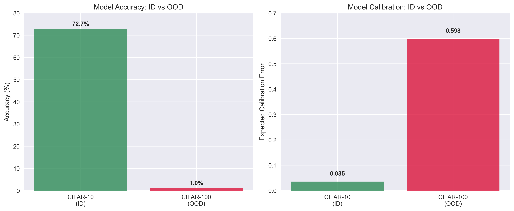
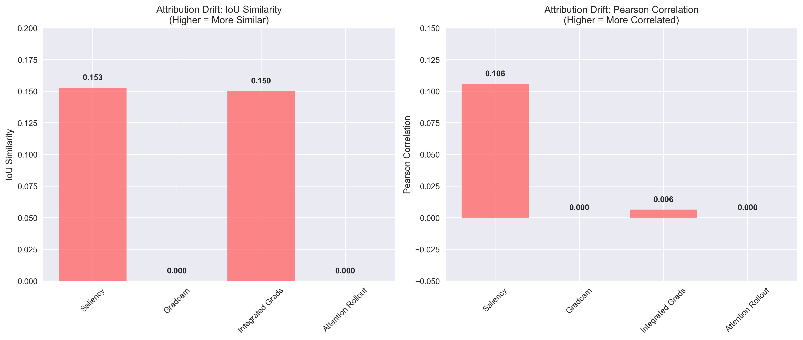
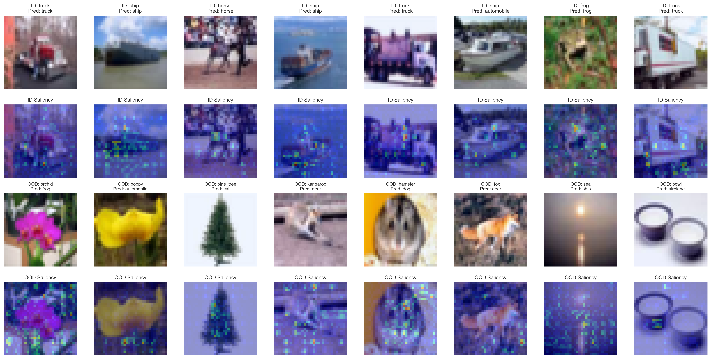

# Interpreting Distribution Shifts in Deep Learning Models

[](https://python.org)
[](https://pytorch.org)
[](LICENSE)

A comprehensive research project investigating how deep learning models behave under distribution shifts, with focus on attribution method robustness and model interpretability across different data distributions.

## Project Overview

This project addresses a critical challenge in AI safety: **What happens when deep learning models encounter data that differs from their training distribution?** Through extensive experiments with Vision Transformers (ViT) and ResNet architectures, we demonstrate that:

- **Models fail catastrophically** on out-of-distribution (OOD) data while maintaining high confidence
- **Attribution methods become unreliable** precisely when interpretability is most needed  
- **Calibration breaks down** creating dangerous "confident but wrong" scenarios
- **Architecture matters** for both performance and interpretability under distribution shift

## Key Research Contributions

### 1. **Comprehensive OOD Analysis Framework**
- Multi-dataset evaluation (CIFAR-10 → CIFAR-100, SVHN)
- Performance, calibration, and attribution drift metrics
- Semantic coherence analysis across distribution shifts

### 2. **Attribution Method Robustness Study**
- Saliency Maps, Grad-CAM, Integrated Gradients, Attention Rollout
- Architecture-specific compatibility analysis
- Correlation and similarity metrics for attribution drift detection

### 3. **Critical Safety Findings**
- **71.73% accuracy drop** on OOD data with maintained 61.9% confidence
- **84.7% attribution dissimilarity** between ID and OOD explanations
- **16.9× calibration degradation** (ECE: 0.035 → 0.598)

## Experimental Results

### Performance Comparison (CIFAR-100 OOD)

| Model | ID Accuracy | OOD Accuracy | Attribution IoU | Calibration ECE |
|-------|-------------|-----------------|-------------------|-------------------|
| **ViT** | 72.74% | 1.01% | 0.153 | 0.598 |
| **ResNet** | 77.02% | 0.90% | 0.123 | 0.662 |

### Key Visualizations

#### Performance Dashboard

*Comprehensive performance analysis showing catastrophic failure on OOD data*

#### Attribution Drift Analysis  

*Attribution method reliability breakdown across distribution shifts*

#### Saliency Maps Comparison

*Visual comparison of attribution methods on ID vs OOD data*

### Key Insights
- **Neither architecture is OOD-safe** without additional safeguards
- **ViT shows better attribution stability** but worse overall performance
- **ResNet offers computational efficiency** but limited attribution consistency
- **Attribution drift serves as OOD indicator** (IoU < 0.2 signals distribution shift)
- **Most Critical Finding**: Attribution drift analysis (Phase 3) reveals whether explanations can be trusted when data distribution changes - crucial for real-world deployment safety

## Quick Start

### One-Click Demo
**Try our interactive Colab notebook to see the critical safety findings in action:**
[](https://colab.research.google.com/github/lauragomez/interpret_shifts/blob/main/quick_demo.ipynb)

*This notebook demonstrates the key findings using cached experimental results - no training required!*

### Installation
```bash
git clone https://github.com/lauragomez/interpret_shifts.git
cd interpret_shifts
pip install -r requirements.txt
```

### Quick Test (Recommended First)
```bash
# Test with ResNet (quick validation)
python experiments/ood_analysis/run_ood_experiments.py \
  --model_path models/resnet_cifar10_best.pth \
  --model_type resnet \
  --quick_test \
  --output_dir results/resnet_quick

# Test with ViT (quick validation)
python experiments/ood_analysis/run_ood_experiments.py \
  --model_path models/vit-hf-scratch-small_cifar10_best.pth \
  --model_type vit \
  --quick_test \
  --output_dir results/vit_quick
```

### Full Experiments

#### 1. Train a Model
```bash
# Train ViT from scratch
python experiments/training/main.py --model vit-hf-scratch --epochs 100 --lr 3e-4 --batch_size 128

# Train ResNet
python experiments/training/main.py --model resnet --epochs 50 --lr 1e-3 --batch_size 64
```

#### 2. Run OOD Analysis
```bash
# Full ResNet experiment on CIFAR-100
python experiments/ood_analysis/run_ood_experiments_cifar100.py \
  --model_path models/resnet_cifar10_best.pth \
  --model_type resnet \
  --output_dir results/resnet_cifar100

# Full ViT experiment on CIFAR-100
python experiments/ood_analysis/run_ood_experiments_cifar100.py \
  --model_path models/vit-hf-scratch-small_cifar10_best.pth \
  --model_type vit \
  --output_dir results/vit_cifar100

# Analyze ResNet on SVHN
python experiments/ood_analysis/run_ood_experiments.py \
  --model_path models/resnet_cifar10_best.pth \
  --model_type resnet \
  --ood_dataset svhn \
  --output_dir results/resnet_svhn
```

#### 3. Compare Results
```bash
# Compare multiple experiment results
python experiments/ood_analysis/compare_ood_results.py --results_dir results/
```

#### 4. Generate Visualizations
```bash
# Create comprehensive analysis dashboard
python experiments/visualization/visualize_ood_results.py --results_dir results/

# Visualize CIFAR-100 specific results
python experiments/visualization/visualize_cifar100_results.py --results_dir results/
```

### What Each Experiment Does

**Phase 1: Attribution Sanity Checks** (~1-2 minutes)
- Tests if attribution methods are working correctly
- Uses simple linear models for validation
- Validates Saliency, Grad-CAM, Integrated Gradients, Attention Rollout

**Phase 2: Performance & Calibration** (~2-3 minutes)
- Evaluates model accuracy on CIFAR-10 (in-distribution)
- Evaluates model accuracy on OOD datasets (CIFAR-100, SVHN)
- Computes Expected Calibration Error (ECE)

**Phase 3: Attribution Drift Analysis** (~5-10 minutes) - **Most Important**
- Computes attributions on both ID and OOD data
- Measures how attribution patterns change (IoU, Pearson correlation)
- **Key insight**: Do explanations remain consistent under distribution shift?

**Phase 4: Corruption Analysis** (~5-15 minutes)
- Tests multiple corruption types (Gaussian noise, brightness, contrast)
- Multiple severity levels per corruption type
- Evaluates robustness under controlled distribution shifts

### Time Estimates

| Experiment Type | Quick Test | Full Experiment |
|----------------|------------|-----------------|
| ResNet | 3-5 min | 15-25 min |
| ViT | 3-5 min | 15-25 min |
| Both + Comparison | 8-12 min | 35-55 min |

### Troubleshooting

**If Model Files Missing:**
```bash
# Check what models are available
python experiments/setup_experiments.py

# Train models if needed
python experiments/training/main.py --model resnet --epochs 50
python experiments/training/main.py --model vit --epochs 50
```

**If Running Out of Memory:**
```bash
# Use smaller batch size
python experiments/ood_analysis/run_ood_experiments.py \
  --model_path <path> --model_type <type> --batch_size 16

# Or use CPU
python experiments/ood_analysis/run_ood_experiments.py \
  --model_path <path> --model_type <type> --device cpu
```

**If Attribution Methods Fail:**
- Some methods may fail on simple models (expected behavior)
- Real trained models should work better
- Results will still be generated with available methods

## Project Structure

```
interpret_shifts/
├── README.md                           # Main project documentation
├── requirements.txt                    # Unified dependencies
├── requirements_ood.txt                # OOD-specific dependencies
├── quick_demo.ipynb                    # One-click Colab demo
├── src/                                # Core source code
│   ├── models/                            # Model architectures
│   │   ├── __init__.py
│   │   ├── resnet.py                      # ResNet-18 implementation
│   │   └── vit.py                         # Vision Transformer implementation
│   └── utils/                             # Utility functions
│       ├── __init__.py
│       ├── attribution_methods.py         # Attribution computation methods
│       ├── datasets.py                    # Dataset loading utilities
│       ├── plot_utils.py                  # Plotting utilities
│       └── utils.py                       # General utilities
├── experiments/                        # Experiment scripts
│   ├── training/                          # Model training scripts
│   │   ├── main.py                        # Main training script
│   │   ├── main_gpu.py                    # GPU-optimized training
│   │   └── resnet_run.sh                  # ResNet training script
│   ├── ood_analysis/                      # Out-of-distribution analysis
│   │   ├── analyze_cifar100_resnet.py     # CIFAR-100 ResNet analysis
│   │   ├── analyze_svhn_resnet.py         # SVHN ResNet analysis
│   │   ├── compare_ood_results.py          # Results comparison
│   │   ├── run_ood_experiments.py         # Main OOD experiment runner
│   │   ├── run_ood_experiments_cifar100.py
│   │   ├── run_ood_experiments_memory_optimized.py
│   │   └── vit_attribution_fix.py         # ViT attribution fixes
│   ├── visualization/                     # Visualization scripts
│   │   ├── generate_plots.py               # Plot generation
│   │   ├── simple_visualize.py             # Simple visualization
│   │   ├── visualize_cifar100_results.py
│   │   ├── visualize_ood_results.py     # Main visualization script
│   │   └── visualize_saliency_maps_cifar100.py
│   ├── gpu_benchmark.py                    # GPU performance benchmarking
│   └── setup_experiments.py                # Experiment setup utilities
├── scripts/                             # Convenience scripts (symlinks to experiments/)
│   └── [mirrors experiments/ structure]
├── results/                             # Experimental results
│   └── consolidated/                       # All experimental results
│       ├── results_cifar100_resnet_gpu/
│       │   ├── analysis/                   # Analysis reports and dashboards
│       │   ├── cifar100_ood_results_resnet_*.json
│       │   ├── cifar100_summary_resnet.csv
│       │   └── visualizations/             # Generated visualizations
│       ├── results_cifar100_vit/
│       │   ├── cifar100_ood_results_vit_*.json
│       │   ├── cifar100_summary_vit.csv
│       │   └── visualizations/             # ViT-specific visualizations
│       └── [other result directories]
├── docs/                                # Documentation
│   ├── reports/                            # Research reports
│   └── visualizations/                     # Documentation visualizations
├── models/                              # Trained model checkpoints
│   ├── resnet_cifar10_best.pth
│   └── vit-hf-scratch-small_cifar10_best.pth
└── examples/                            # Usage examples
    ├── quick_start.py                      # Basic usage example
    ├── custom_analysis.py                  # Advanced analysis example
    └── commands.txt                        # Useful commands
```

### Key Components

**Source Code (`src/`)**
- **Models**: ResNet-18 and Vision Transformer implementations
- **Utils**: Core utilities for training, evaluation, and analysis
- **Attribution Methods**: Saliency, Grad-CAM, Integrated Gradients, Attention Rollout

**Experiments (`experiments/`)**
- **Training**: Model training scripts with advanced optimization
- **OOD Analysis**: Comprehensive out-of-distribution evaluation
- **Visualization**: Analysis and plotting utilities

**Results (`results/consolidated/`)**
- Analysis reports and dashboards
- Generated visualizations and plots
- Model weights and checkpoints
- JSON results and CSV summaries

### Usage Patterns

**For Researchers:**
1. Start with this README for overview
2. Run experiments: `experiments/` for custom analysis
3. View results: `results/consolidated/` for generated artifacts
4. Review code: `src/` for implementation details

**For Practitioners:**
1. Quick start: `examples/quick_start.py`
2. Training: `experiments/training/main.py`
3. Analysis: `experiments/ood_analysis/run_ood_experiments.py`
4. Visualization: `experiments/visualization/visualize_ood_results.py`

**For Developers:**
1. Core code: `src/` for implementation details
2. Experiments: `experiments/` for methodology
3. Examples: `examples/` for usage patterns
4. Results: `results/` for validation

## Research Methodology

### Datasets
- **In-Distribution**: CIFAR-10 (10 classes, 32×32 images)
- **Out-of-Distribution**: 
  - CIFAR-100 (100 classes, similar domain)
  - SVHN (different domain, overlapping classes)

**Dataset Selection Rationale**: We deliberately chose CIFAR-10/100 and SVHN as our evaluation benchmarks for several critical reasons:
- **Controlled Environment**: These datasets provide a controlled laboratory setting for mechanistic analysis of distribution shift effects
- **Computational Efficiency**: Enables extensive experimentation with multiple models, attribution methods, and hyperparameter sweeps
- **Established Baselines**: Well-studied datasets with known failure modes, allowing for systematic comparison with existing literature
- **Reproducibility**: Standardized datasets ensure experimental reproducibility and facilitate comparison across research groups
- **Mechanistic Insights**: The relatively simple visual features in these datasets make it easier to understand and interpret model behavior under distribution shift

### Models
- **Vision Transformer (ViT)**: Transformer-based architecture
- **ResNet-18**: Convolutional neural network with residual connections

### Attribution Methods
- **Saliency Maps**: Gradient-based pixel importance
- **Grad-CAM**: Class activation mapping (CNN-specific)
- **Integrated Gradients**: Path-integrated attributions
- **Attention Rollout**: Transformer attention visualization

### Evaluation Metrics
- **Performance**: Accuracy, F1-score
- **Calibration**: Expected Calibration Error (ECE)
- **Attribution Drift**: IoU similarity, Pearson/Spearman correlation
- **Semantic Analysis**: Prediction distribution, confidence analysis

## Key Findings

### Critical Safety Issues
1. **Silent Failure Mode**: Models fail catastrophically while appearing confident
2. **Explanation Unreliability**: Attribution methods become meaningless on OOD data
3. **No Built-in Detection**: Models lack mechanisms to identify distribution shift
4. **Systematic Biases**: Predictable failure patterns that could be exploited

### Architecture-Specific Insights
- **ViT Strengths**: Better attribution stability, superior calibration behavior
- **ResNet Strengths**: Computational efficiency, broad interpretability compatibility
- **Both Limitations**: Catastrophic OOD performance, unreliable confidence estimates

## Technical Implementation

### Core Features
- **Modular Design**: Easy to extend with new models and attribution methods
- **Comprehensive Evaluation**: Multi-faceted analysis combining performance, calibration, and interpretability
- **Reproducible Results**: Fixed random seeds and complete parameter specifications
- **Memory Optimization**: Efficient data loading and GPU utilization

### Advanced Capabilities
- **Cross-dataset validation**: Multiple OOD scenarios
- **Corruption robustness**: Performance under various corruption levels
- **Semantic coherence**: Analysis of prediction patterns
- **Real-time monitoring**: Training progress and convergence analysis

## Generated Artifacts

### Analysis Reports
- **Comprehensive OOD Analysis**: Detailed performance and calibration breakdown
- **Attribution Drift Study**: Method-specific robustness analysis
- **Architecture Comparison**: ResNet vs ViT comprehensive evaluation
- **Safety Assessment**: Risk analysis for production deployment

### Visualizations
- **Performance Dashboards**: Multi-metric comparison charts
- **Attribution Drift Plots**: IoU and correlation analysis
- **Semantic Analysis**: Prediction distribution and confidence patterns
- **Calibration Assessment**: Reliability diagrams and ECE analysis

## Applications

### Research Use Cases
- **AI Safety Research**: Understanding model limitations under distribution shift
- **Interpretability Studies**: Evaluating explanation method robustness
- **Model Evaluation**: Comprehensive assessment beyond accuracy metrics
- **OOD Detection**: Developing methods for distribution shift identification

### Industry Applications
- **Medical AI**: Ensuring reliable diagnosis across diverse patient populations
- **Autonomous Systems**: Safe deployment in novel environments
- **Financial Systems**: Robust risk assessment under changing market conditions
- **Quality Assurance**: Model reliability testing for production deployment

## Future Work

### Immediate Next Steps
- [ ] Complete ResNet analysis on additional OOD datasets
- [ ] Implement proposed OOD detection methods
- [ ] Test calibration improvement techniques
- [ ] Extend to vision-language models

### Long-term Research
- [ ] Hybrid architectures combining CNN and Transformer strengths
- [ ] Attribution-aware training for consistent explanations
- [ ] Real-world deployment testing
- [ ] Regulatory framework development for OOD safety

## References

### Key Papers
- [Attention Is All You Need](https://arxiv.org/abs/1706.03762) - Transformer architecture
- [ResNet](https://arxiv.org/abs/1512.03385) - Residual networks
- [Grad-CAM](https://arxiv.org/abs/1610.02391) - Class activation mapping
- [Integrated Gradients](https://arxiv.org/abs/1703.01365) - Attribution method

### Related Work
- Distribution shift detection methods
- Model calibration techniques
- Attribution method robustness
- AI safety and reliability

## Contributing

We welcome contributions! Please see our [Contributing Guidelines](CONTRIBUTING.md) for details.

### Areas for Contribution
- New attribution methods
- Additional OOD datasets
- Improved visualization tools
- Documentation improvements
- Performance optimizations

## License

This project is licensed under the MIT License - see the [LICENSE](LICENSE) file for details.

## Authors

**Laura Gomez** - *Initial work and comprehensive analysis*
- GitHub: [@lauragomez](https://github.com/lauragomez)
- Email: laura.gomez@stanford.edu

## Acknowledgments

- PyTorch team for the excellent deep learning framework
- Hugging Face for transformer model implementations
- Captum team for attribution method implementations
- CIFAR and SVHN dataset creators for providing evaluation benchmarks

## Contact

For questions, suggestions, or collaboration opportunities:
- **Email**: laura.gomez@stanford.edu
- **GitHub Issues**: [Create an issue](https://github.com/lauragomez/interpret_shifts/issues)
- **Discussions**: [Join the conversation](https://github.com/lauragomez/interpret_shifts/discussions)

---

**Important Notice**: This research demonstrates critical safety limitations in current deep learning models. Models should never be deployed in production without proper OOD detection and uncertainty quantification mechanisms.

**Research Impact**: This work provides both a sobering assessment of current AI limitations and a roadmap for building more reliable, interpretable, and safe AI systems.